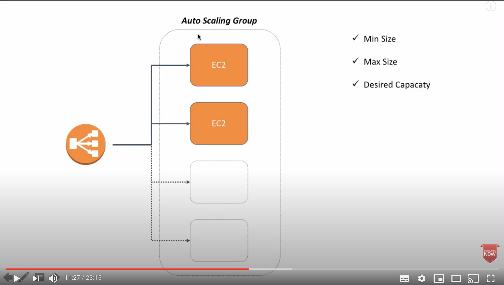

# Inspiration

Inspiration for this repo was a couple of YouTube tutorials from [Java Home Cloud](https://www.youtube.com/javahomecloud) where it was demonstrated how to create AWS Application Load Balancers and Auto Scaling groups.

  
  

## Assumption

This is not a beginner's guide to learning [Terraform](https://www.terraform.io/) or [AWS](https://aws.amazon.com/). It is assumed the reader is already familier with these technologies and would instead like to find related topics like ASG and LB in one place for reference purpose.

## Scope

I wanted to take a step further and automate the video instructions. The idea is that setting up of the infrastructure should be automated without human intervention. 

This includes using [Terraform Registry](https://registry.terraform.io/) modules for creating:

- Virtual Private Cloud _(VPC)_ that host the entire infrastructure in this repo.
- VPC is subdivided in four subnets; two are public and two are private
- Application Load Balancer _(ALB)_ in public subnets
- Network Load Balancer _(NLB)_ in public subnets
  - Code has been written but commented out for the following reasons:
    - NLB target groups appear to delete ALB target groups
    - For NLB to work alongside ALB, ASG security will need to be open from the entire world e.g. 0.0.0.0/0. And so, I did not want to open security group so widely
- Classic ELB _(ELB)_ in public subnets
- Auto Scaling Group _(ASG)_ in private subnets and are only reachable via LB on port 80
- Auto Scaling policies for scaling up / down instances based on CloudWatch CPU alarms raised
- Security groups that only allow traffic on port 80 to EC2 instances via LB

## Create infrastructure

This is how infrastrucutre is setup with Terraform:

- `terraform init`
- `terraform apply -auto-approve`

## Test

- Classic ELB and ALB were created above. Use DNS records for each of the LB for testing. 
- Refreshing the pages should return different result depending which ASG the LB routed traffic to.

## Destroy infrastructure

This is how the infrastructure created above may be destroyed if it is no longer needed

- `terraform destroy -auto-approve`

## Reference

- [cloud-init Documentation](https://cloudinit.readthedocs.io/)
- [Terraform Registry](https://registry.terraform.io/)
- [KnowledgeIndia](https://youtu.be/bhobfyQ9SSE) - Auto Scaling Group, Launch Configuration, Scale-out & Scale-in Policies
- [KnowledgeIndia](https://youtu.be/OKnd03nxu3k) - Application Load Balancer - Setup & DEMO - Differences from Classic ELB
- [KnowledgeIndia](https://youtu.be/WRUA370p7jE) - Network Load Balancer DEMO 
- [KnowledgeIndia](https://youtu.be/txTPrM5proQ) - Classic ELB DEMO - Setup with Private instances
-  A visual representation of ALB and Terraform [code example](https://medium.com/cognitoiq/terraform-and-aws-application-load-balancers-62a6f8592bcf) 

