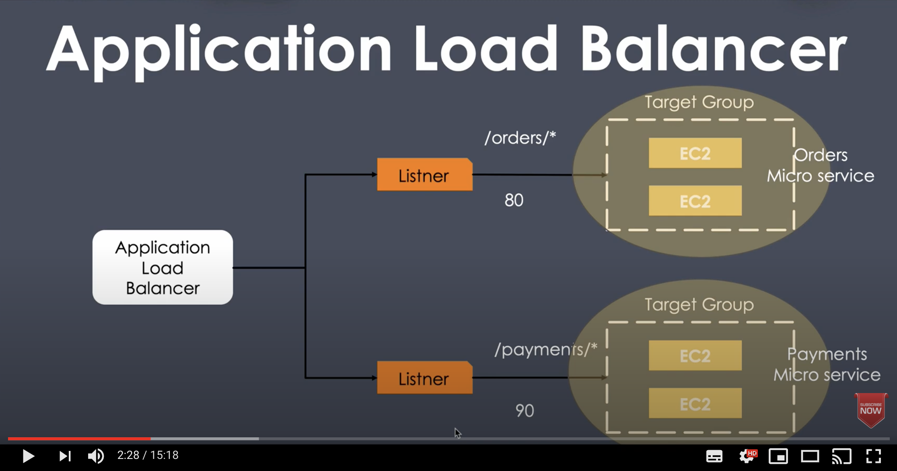

# Inspiration

Inspiration for this repo was a couple of YouTube tutorials from [Java Home Cloud](https://www.youtube.com/javahomecloud) where it was demonstrated how to create AWS Application Load Balancers and Auto Scaling groups.

  
  

## Scope

I wanted to take a step further and automate the instructions. This includes using Terraform registry modules for:

- ALB
- ASG
- Security groups
- VPC

The idea is that infrastructure should be setup without human intervention

## Create infrastructure

This is how infrastrucutre is setup with Terraform:

- `terraform init`
- `terraform apply -auto-approve`

## Test

- Find DNS A record for the load balancer and hit it a few time in your web browser. You will notice Apache web server is being load balanced

## Destroy infrastructure

- `terraform destroy -auto-approve`

## Reference

- [cloud-init Documentation](https://cloudinit.readthedocs.io/)
- [Terraform Registry](https://registry.terraform.io/)